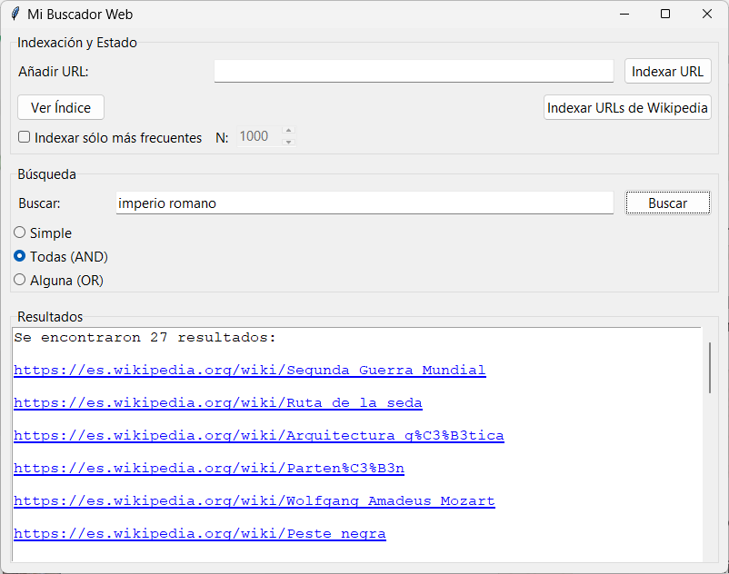

# 🔎 Proyecto de Laboratorio: Mi Buscador Web
## Fundamentos de Programación 1. Grado en Ingeniería Informática – Inteligencia Artificial (Universidad de Sevilla)

Un **Buscador Web** es una herramienta fundamental de Internet, pero ¿cómo funciona por dentro? Su componente clave es el **índice invertido**. En lugar de almacenar una lista de direcciones de páginas web (URLs) y las palabras que contiene cada una, un índice invertido hace lo contrario: funciona como un diccionario gigante donde las claves son las **palabras** y los valores son un **conjunto de URLs** (páginas) donde aparece esa palabra.

Por ejemplo:
* `"python"`: `{ "url_A.com", "url_C.com" }`
* `"hola"`: `{ "url_B.com" }`
* `"mundo"`: `{ "url_A.com", "url_B.com" }`

Con esta estructura, buscar es muy rápido. Si buscamos "hola", solo tenemos que consultar el índice para esa palabra y obtenemos `{ "url_B.com" }`. Si buscamos "python Y mundo" (AND), calculamos la **intersección** de sus conjuntos: `{ "url_A.com" }`. Si buscamos "python O mundo" (OR), calculamos la **unión**: `{ "url_A.com", "url_B.com", "url_C.com" }`.

En esta práctica implementaremos las funciones necesarias para construir y consultar un índice invertido básico. Representaremos el índice con un diccionario de Python (`dict`) y los listados de páginas con conjuntos (`set`) para poder realizar operaciones de unión e intersección de forma eficiente.

Disponemos de una interfaz gráfica ya implementada, preparada para indexar páginas web (individualmente o un lote de Wikipedia) y realizar búsquedas sobre el índice que construyamos:

* Puedes pulsar el botón "Indexar URLs de Wikipedia" para que se lleve a cabo la indexación de un conjunto de páginas de ejemplo.
* Puedes meter otras URLs en el índice mediante el campo de texto "Añadir URL", pulsando el botón "Indexar URL".
* Una vez construido el índice, puedes ver su contenido y algunas estadísticas mediante el botón "Ver Índice".
* También puedes llevar a cabo búsquedas escribiendo una o varias palabras en la caja de texto "Buscar" y pulsando el botón "Buscar".

Sin embargo, **para que estas funcionalidades se puedan ejecutar correctamente, aún están por implementar las distintas funciones que crean y consultan el índice**. Esta será tu tarea.

---

## Preparación del entorno

👉 Para configurar Git y clonar el repositorio del laboratorio, consulta **[instrucciones_git.md](https://github.com/FP1-25-26/FP1-LAB01-Calculadora-de-viajes-espaciales/blob/main/instrucciones_git.md)**.

---

## ⏱ Duración estimada

2 horas

---

## ✅ ¿Qué se practica?

* Procesamiento de texto (cadenas de caracteres, `str`)
* Diccionarios (`dict`) para indexación
* Conjuntos (`set`) para almacenar URLs y operar con ellas (intersección, unión)
* Diccionarios de recuentos (`Counter`)

---

## 📁 Archivos del proyecto

Dispones de estos archivos en `src`:

| Archivo | Qué hace |
| :--- | :--- |
| `buscador_gui.py` | Interfaz de usuario (ya implementada) |
| `buscador_utiles.py` | Funciones a implementar por el estudiante |
| `buscador_utiles_test.py` | Pruebas de las funciones del módulo `buscador_utiles.py` |

---

### Representación del índice

En los siguientes ejercicios, trabajaremos con el `indice` del buscador, que almacena como claves **palabras** y como valores **conjuntos de URLs** donde aparecen dichas palabras. Por tanto, el tipo de `indice` será `dict[str, set[str]]`.

## 📌 Ejercicio 1: Función `normalizar_texto`

Implementa la función `normalizar_texto` que recibe un texto y devuelve una lista de palabras "limpias".

En el proceso de limpieza, la función debe:
1.  Convertir el texto a **minúsculas**.
2.  Quitar los signos de puntuación (reemplazar cada carácter de la variable `PUNTUACION` por un espacio).
3.  Dividir el texto en palabras.
4.  Filtrar (eliminar) las palabras huecas (aquellas contenidas en la variable `STOP_WORDS`) y las que no estén formadas por únicamente por letras.

Por ejemplo, `normalizar_texto("¡Hola, Mundo! ¿Qué tal?")` debería devolver `['hola', 'mundo', 'qué', 'tal']`.

Prueba la función ejecutando las pruebas del módulo `buscador_utiles_test.py`.

## 📌 Ejercicio 2: Función `procesar_url_en_indice`

Implementa la función `procesar_url_en_indice` que recibe la `url` de una página web, el `texto` que se ha extraído de dicha página web y el `indice` de nuestro buscador. La función **actualiza el índice** para registrar que todas las palabras del texto se encuentran en esa URL.

Puedes usar el siguiente algoritmo:
* Obtener la lista de palabras normalizadas del `texto` (usando la función del Ejercicio 1).
* Para cada palabra `p` de esa lista.
  * Si la palabra `p` no está aún en el `indice`, crea una entrada para ella con un conjunto vacío.
  * Añade la `url` al conjunto de esa palabra.

Prueba la función ejecutando las pruebas del módulo `buscador_utiles_test.py`.

**¿Cómo utiliza esta función nuestra aplicación?:** la aplicación comienza definiendo un diccionario vacío como índice, e irá invocando a la función `procesar_url_en_indice` cada vez que se quiera incorporar una nueva página web al buscador. 

## 📌 Ejercicio 3: Función `buscar_palabra_simple`

Implementa la función `buscar_palabra_simple` que recibe una `palabra` de búsqueda y el `indice`, y devuelve un **conjunto (`set`) de URLs** donde se encontró esa palabra.

Ten en cuenta que:
* La `palabra` de búsqueda debe ser **normalizada** antes de buscarla en el índice (usa la función del Ejercicio 1 `normalizar_texto`, y ten en cuenta que devuelve una lista, por lo que deberás coger el primer elemento).
* Si la palabra normalizada no se encuentra en el índice, la función debe devolver un **conjunto vacío**.

Prueba la función ejecutando las pruebas del módulo `buscador_utiles_test.py`.

## 📌 Ejercicio 4: Función `buscar_palabras_or`

Implementa la función `buscar_palabras_or` que recibe una `frase` de búsqueda y el `indice`, y devuelve un conjunto de URLs donde se encuentre **ALGUNA** de las palabras de la frase.

Puedes usar el siguiente algoritmo:
* Normaliza la `frase` para obtener la lista de palabras de búsqueda.
* Crea un conjunto de resultado vacío.
* Recorre **todas** las palabras de la lista normalizada.
    * Busca la palabra actual (usando `buscar_palabra_simple`).
    * Actualiza el resultado incorporando los resultados de la palabra actual.
* Devuelve el resultado final.

Prueba la función ejecutando las pruebas del módulo `buscador_utiles_test.py`.

## 📌 Ejercicio 5: Función `buscar_palabras_and`

Implementa la función `buscar_palabras_and` que recibe una `frase` de búsqueda y el `indice`, y devuelve un conjunto de URLs donde se encuentren **TODAS** las palabras de la frase.

Puedes usar el siguiente algoritmo:
* Normaliza la `frase` para obtener la lista de palabras de búsqueda.
* Si la lista de palabras está vacía, devuelve un conjunto vacío.
* Busca la **primera** palabra en el índice (usando `buscar_palabra_simple`) y guarda el resultado.
* Recorre el **resto** de palabras de la lista.
    * Busca la palabra actual (usando `buscar_palabra_simple`).
    * Actualiza el resultado calculando la **intersección** con el resultado de la palabra actual.
* Devuelve el resultado final.

Prueba la función ejecutando las pruebas del módulo `buscador_utiles_test.py`.

## 📌 Ejercicio 6: Función `procesar_url_en_indice_top_n`

Implementa la función `procesar_url_en_indice_top_n`. Esta función es similar a `procesar_url_en_indice`, pero solo indexa las `top_n` (por ejemplo, 1000) palabras **más frecuentes** del texto recibido. De esta manera, pretendemos reducir el tamaño que ocupa el índice en memoria, descartando las palabras menos importantes de los textos de las webs.

Puedes usar el siguiente algoritmo:
* Normaliza el `texto`.
* Construye un **diccionario** con los **recuentos** de las palabras del texto.
* Obtén las `top_n` palabras con los recuentos mayores de ese diccionario.
* Indexa las palabras obtenidas junto a la URL (de forma idéntica al Ejercicio 2).

Prueba la función ejecutando las pruebas del módulo `buscador_utiles_test.py`.

**¿Cómo utiliza esta función nuestra aplicación?:** Si en la aplicación se marca el check "Indexar solo más frecuentes", las URLs que se indexen lo harán mediante esta función. Puedes configurar el valor de top-n mediante el valor que se escribe en la caja de texto etiquetada con N. Indexa las URLs de Wikipedia y visualiza el índice que se ha construido, y observa la reducción en el tamaño en memoria.

## 📌 Ejercicio 7: Función `calcula_estadisticas_indice`

Implementa la función `calcula_estadisticas_indice` que recibe el `indice` y devuelve una tupla con tres valores:
1.  **Número total de palabras** indexadas (entero).
2.  **Número total de URLs únicas** indexadas (entero).
3.  **Promedio de URLs por palabra** (flotante).

**Consejos**:
* El número de palabras es simplemente el número de claves del diccionario.
* Para contar las URLs únicas, puedes crear un conjunto auxiliar e ir añadiendo todos los conjuntos de URLs de cada palabra del índice. El tamaño de ese conjunto auxiliar será el total de URLs únicas.
* Para el promedio, necesitarás sumar cuántas URLs hay en total (contando repetidas) y dividirlo por el número de palabras. Ten cuidado con la división por cero si el índice está vacío.

Prueba la función ejecutando las pruebas del módulo `buscador_utiles_test.py`.
